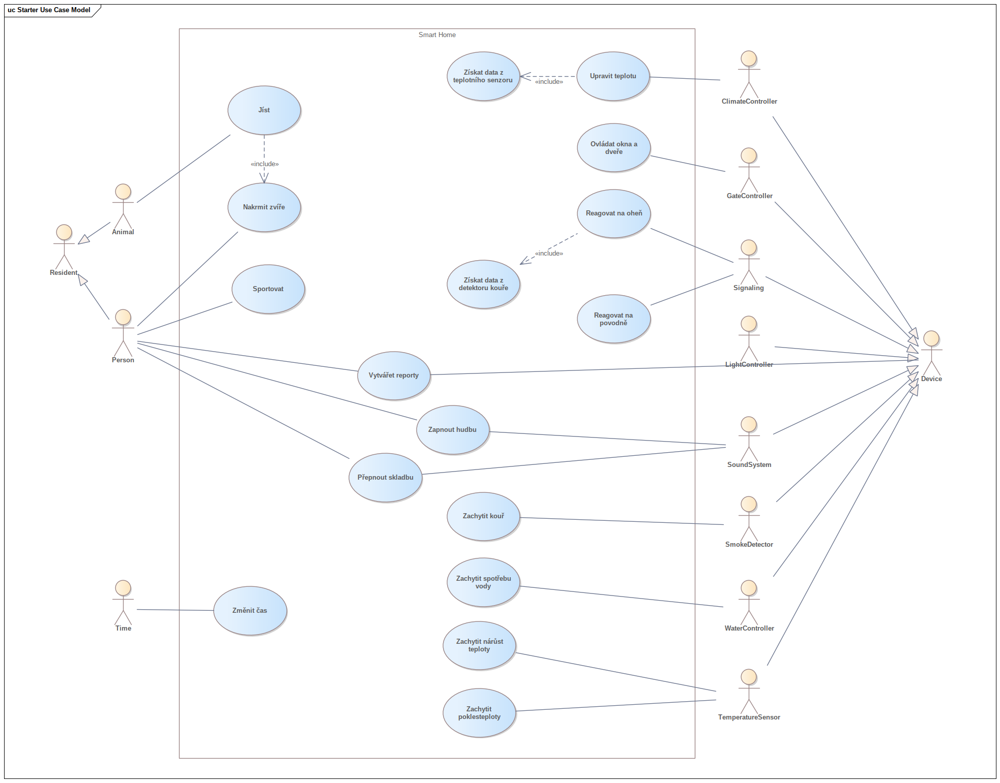
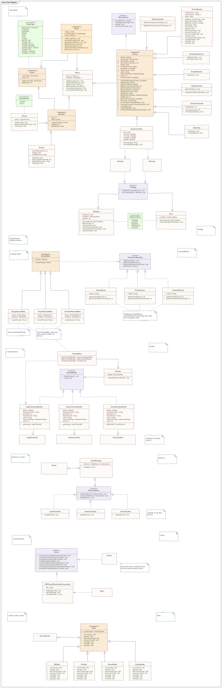

# Popis

Pattern **Factory** se používá k sestavení různých konfigurací domů na základě globálního konfiguračního souboru. K dispozici jsou celkem tři konfigurac: Simple House, Extended House a Empty House. Pattern **Builder** se používá k vytváření zařízení.

Pro definování události a možnosti jejího následného zpracování se používá pattern **Observer**, mechanismus předplatného pro zařízení a obyvatele. Když nastane určitá událost, zareagují na ni ti, kdo jsou k odběru této události.

Device Gate Controller pracuje na základě patternu **Strategy**. Obsahuje dvě strategie, ranní a večerní. Každý z nich interaguje s dveřmi a okny svým vlastním způsobem. Device Sound System funguje na základě patternu **State**. Je schopen měnit svůj stav v závislosti na aktuálním.

Uživatel může určit, které statistiky ho zajímají a které ne. Každé zařízení generuje kompletní statistiku. K vytvoření dílčí statistiky se používá pattern **Visitor**. Program umožňuje například sestavit report o spotřebě elektřiny libovolného počtu zařízení v domě a exportovat jej do formátu PDF.

# Use case model
 

# Class diagram
 
